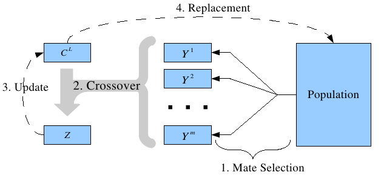

.. Blga documentation master file, created by
   sphinx-quickstart on Sun Aug  7 14:16:23 2011.
   You can adapt this file completely to your liking, but it should at least
   contain the root `toctree` directive.

Welcome to Blga's documentation!
================================
Binary-coded LGA (BLGA) is a Steady-state GA that
inserts one single new member into the population (P) in each iteration. It uses
a crowding replacement method (restricted tournament selection (RTS) in
order to force a member of the current population to perish and to make room
for the new offspring. It is important to know that RTS favours the formation
of niches in P (groups of chromosomes with high quality located in different
and scattered regions of the search space). In addition, the BLGA maintains an
external chromosome, the leader chromosome (C\ :sub:`L`\), which is always selected as
one of the parents for the crossover operation. The following sections indicate
the main components of the BLGA.

How it works?
=============
The general BLGA's schema is represented in the next image:

   BLGA's schema

Contents:

.. toctree::
   :maxdepth: 2

Indices and tables
==================

* :ref:`genindex`
* :ref:`modindex`
* :ref:`search`

