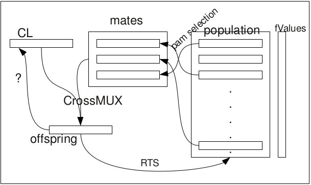

.. _blga:

:cpp:class:`Blga`
=================
:cpp:class:`Blga` is the base class for all Binary-coded Local Genetitc 
algorithms. It implements :ref:`LocalSearcher` base class and it also defines
interface for all Blga subclasses. Next image represents how :cpp:class:`Blga`
works:

  Blga's schemas

Protected members
-----------------
.. cpp:member:: char** population

.. cpp:member:: double* fValues

  :cpp:member:`population` fitness vector.

.. cpp:member:: int popSize

  :cpp:member:`population` size.

.. cpp::member: int lastIndex

  Auxiliary variable.

.. cpp:member:: FitnessFunction* ff

  :cpp:class:`FitnessFunction` object used for all fitness calculations.

.. cpp:member:: char* offspring

  Each new generated individual chromosome is kept here.

.. cpp:member:: char *cl
  
  Leader chromosome, best solution found so far.

.. cpp:member:: char *mask

  :cpp:member:`mask` is used for avoiding visit solutions already explored.

.. cpp:member:: Random* random

  This :ref:`Random` object is used when randoms numbers, permutations,... are needed.

.. cpp:member:: int dimension
  
  Length of each individual chromosome.

.. cpp:member:: int numMates

  Number of chromosomes used by Multiparent Uniform Crossover (MUX)
  (:cpp:func:`crossMUX`).

.. cpp:member:: int pamNass

  Number of chromosomes participating on Positive Assortative Mating (PAM)
  (:cpp:func:`pamSelection`).

.. cpp:member:: int rtsNass

  Number of chromosomes participating on Restricted Tourname Selection (RTS)

.. cpp:member:: double probMUX

  Probability used by :cpp:func:`crossMUX`

.. cpp:member:: double fCL

  :cpp:member:`cl` fitness.

.. cpp:member:: char* auxStr

  Auxiliary variable

.. cpp:member:: int numProtected

  Number of bits protected by :cpp:member:`mask`, once 
  :cpp:member:`numProtected` is equal to :cpp:member:`dimension` we know we can
  get further improvements.

.. cpp:member:: bool repulse

  Boolean value needed by :cpp:func:`croosMUX`

.. cpp:member:: int itC
  
  This value represents how frequently is called :cpp:func:`iterate`, being
  called :cpp:func:`fastIterate` all remaining iterations.

.. cpp:member:: ResultWriter<std::ofstream>* rw_

  :ref:`ResultWriter` object used for outputting

.. cpp:function:: void crossMUX(double probM, char *cl, char **mates, int numMates, char *off, char *mask, int size)

  This **virtual** method implements Uniform Multiparent Crossover. New
  individual is kept in **off** attribute

.. cpp:function:: int pamSelection(int nass, char *cl, int dimension, char** selected = 0, int numselected = 0)

  It performs PAM selection, returning index of selected individual.

.. cpp:function:: int distance(char *s1, char *s2, int size, int maxDistance = -1)

  It performs Hamming distance calculations, needed to similarity computing of 
  individuals pairs [#f1]_

.. cpp:function bool hasConverged()

  Retunrs True if convergence is reached.

Public members
--------------

.. cpp:function:: Blga(int itC, int popSize, int dimension, double probMux, int numMates,int pamNass, int rtsNass, FitnessFunction *ff, Random *random)

  Class constructor

.. cpp:function:: Blga(int itC, int popSize, int dimension, int alfa, int numMates, int pamNass, int rtsNass, FitnessFunction *ff, Random *random)

  **Overloaded** class constructor, it computes probMux based on 
  :cpp:member:`dimension` and **alfa** attribute.
      
.. cpp:function:: void iterate()

  **Virtual** method performing each iteration

.. cpp:function:: void fastIterate()

  Fast :cpp:func:`iterate` version (**virtual** too)
      
.. cpp:function:: int improve(char *s, double& fitness, int size,int maxEvaluations, int iRuns, int current_nFEs, int fNumber, const char *name)

  **Virtual** method performing iterations until stop condition or convergence is reached.

.. cpp:function:: int improve(char *s, double& fitness, int size)

  **Overloaded** version

.. cpp:function:: void resetPopulation()

  **Virtaul** method reseting population, so consecutive runs can be achieved
  using the same object

.. cpp:function:: void setFF(FitnessFunction* ff)

  :cpp:class:`FitnessFunction` object setter

.. cpp:function:: void writeResults(int iRuns, int nFEs, int functionNumber, bool is_last_run, bool is_last_iteration)

  This **virtual** method writes results using an :ref:`ResultWriter` class.

.. cpp:function:: void swap(int* a, int* b)

  Auxiliary function swapping two int vector contains

.. cpp:function void quicKSort(int* arr, int beg, int end)

  Quick sort ordering function

.. [#f1] http://en.wikipedia.org/wiki/Hamming_distance