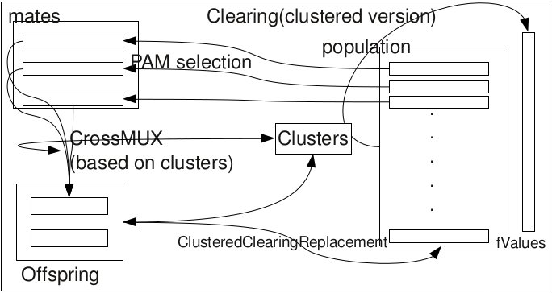

:cpp:class:`ClusteredClearing`
==============================
:cpp:class:`ClusteredClearing` inherits from :ref:`Blga` and reimplemnts 
some of its methods. This subclass is an attempt to fix all problems of
:ref:`Blga`. Next schema represents how it works

  Clustered clearing's schema

Schema can be a little bit confusing so further information is needed:

* Initially clustered clearing is done. This is like normal clearing, but keeping
  information about niches, such as clustering does.
* Then we apply PAM and crossMUX as Blga does, but using clusters information,
  so the idea is generating offspring for all niches
* Once offspring is generated, we apply clusteredClearingReplacement. This
  replacement technique is special designed for this algorithm. Replaces
  chromosomes based on number of individual on a niche and fitness of the best
  chromosome on that niche.

Macros
------

.. c:macro:: struct Off{char* genotype; double fitness}

  Since :cpp:class:`ClusteredClearing` generates several offspring each 
  iteration, a new structure to keep them is needed. This struct does such a 
  task.

.. c:macro:: struct Cluster {int cIndex; int size; string mask; int numProtected}

  As all niching techniques does :cpp:class:`ClusteredClearing` forms niches, 
  but it does explicitly, keeping an structure containing information about each
  one of the niches.

Protected members
-----------------

.. cpp:function:: void crossMUX(double probM, Cluster &clus, char **mates, int numMates, char *off, int size)

  This **virtual** method implements Uniform Multiparent Crossover. New
  individual is kept in **off** attribute

.. cpp:function bool hasConverged()

  Returns True if convergence is reached.

Public members
--------------

.. cpp:function:: ClusteredClearing(int nOff, int popSize, int dimension, double probMux, int numMates, int pamNass, int rtsNass, FitnessFunction* ff, Random* random, double clRadius)

  Class constructor

.. cpp:function:: ClusteredClearing(int nOff, int popSize, int dimension, int alfa, int numMates, int pamNass, int rtsNass, FitnessFunction *ff, Random* random, double clRadius)

  **Overloaded** class constructor, it computes probMux based on 
  :cpp:member:`dimension` and **alfa** attribute.
  
.. cpp:function:: int improve(char *s, double& fitness, int size,int maxEvaluations, int iRuns, int current_nFEs, int fNumber, const char *name)

  **Virtual** method performing iterations until stop condition or convergence is reached.
  
.. cpp:function:: vector<Param> get_params(void)

    This method is used to request local searchers for the parameters
    they are using, so they can be used by :ref:`WriteResults` classes. 
    Overrides :ref:`LocalSearcher` virtual method.
      
Private members
---------------

.. cpp:member:: int _numEval

  Number of evaluations made in last iteration

.. cpp:member:: vector<\Cluster> _cs

  Holds cluster information

.. cpp:member:: vector<\Off> _offsprings

  Holds offspring information

.. cpp:member:: double _clRadius

  Clearing radius

.. cpp:member:: int* _cluster

  Vector that represents the cluster being belonged to for each chromosome

.. cpp:function:: void clearing()

  Performs clearing

.. cpp:function:: void clusteredClearingReplacement()

  Specifically designed replacement method for :cpp:class:`ClusteredClearing`

.. cpp:function:: int searchReplaced()

  Returns index from chromosome to be replaced

.. cpp:function:: int searchWorst(int cluster)

  Searches for worst individual for a given cluster, returning its index

