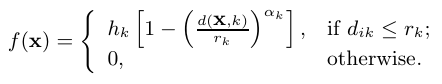
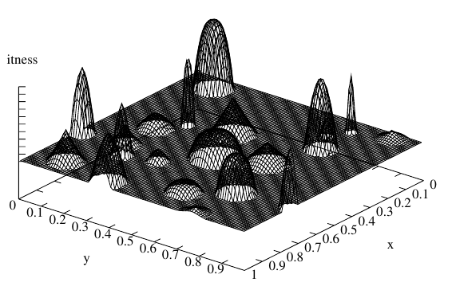

:cpp:class:`HumpFunction`
=========================
:cpp:class:`HumpFunction` inherits from :ref:`FitnessFunction` implementing a 
Hump function. Hump is a multi-variable function, in which K peaks (all maxima) 
are generated at random locations, with different shapes and size. All variables
are initialized within [0, 1]. First, the location :math:`x_k^*` and radius 
:math:`r_k` of the basin
of attraction k of each maximum is randomly created so that the distance
between the two neighboring maxima (l and m) is at least equal to 
(:math:`r_l + r_m` ). 
For the k-th maxima, a peak-height :math:`h_k` and a shape factor :math:`\alpha_k` 
are also randomly 
chosen. To compute the objective value of a solution x, first the nearest
peak (say k-th maximum, residing in the basin of attraction of k-th peak) is 
identified and then the Euclidean distance :math:`d(x, k)` is identified between the 
solution x and the center of the k-th maximum. Then, the following equation is 
used to compute the function value:

.. _formula:

  Hump function

With the above setting, multi-modal test problems having different complexities 
can be created by choosing :math:`h_k` , :math:`r_k` , :math:`\alpha_k` and 
maximum number of peaks K. Next 
figure shows the resulting hump function for a two-variable, 20-peaked (K =
20) problem having different values of :math:`h_k` , :math:`r_k` and :math:`\alpha_k`

  20-Peaked Hump function

Public members
--------------

.. cpp:function:: HumpFunction(char *filename, int nvariables,int kpeaks, double radius,double alpha = 1.0, double height = 1.0, int dimension = 30)

  Class constructor

.. cpp:function:: double fitness(char* genes)

  Computes fitness for a given chromosome

.. cpp:function:: int searchClosestPeak(double *vector, double &distance)

  Searches for closest peak for a given chromosome by their real value

.. cpp:function:: double compare(double f1, double f2)
 
  Compares two fitness values, returning greater, equal
  or less than zero depending if f1 fitness is better, equal or worse than f2's.

.. cpp:function:: stringstream& getName()

  Returns :cpp:member:`_ss` object containing fitness function name

.. cpp:function:: int getFunctionNumber()

  Returns fitness function number

.. cpp:function:: int getDim()

  Returns :cpp:member:`_dimension` value

.. cpp:function:: double distance(char *first, char* second)

  Computes real distance between two individuals

.. cpp:function:: double distance(double *first, double* second)

  **Overloaded** method, receiving real values

.. cpp:function:: void binaryToDoubleVector(char* genes, double* vectir)

  Returns real value for each variable for a given chromosome

.. cpp:function:: double binaryToDouble(char *genes)

  Not used by this class 

.. cpp:function:: int getNvariables()

  Returns :cpp:member:`_nVariables` value

Private members
---------------

.. cpp:member:: double _radius

  Radius for all peaks (they are using all same radius)

.. cpp:member:: double _alpha

  :math:`\alpha_k` in :ref:`formula` formula, used by all peaks

.. cpp:member:: double _height

  Height of each one of the peaks

.. cpp:member:: int _nVariables

  Number of variables used in current Hump

.. cpp:member:: int _kPeaks

  Number of peaks

.. cpp::member:: int _dimension

  Number of bits of each variable (so total length is :cpp:member:`_dimension`
  * :cpp:member:`_nVariables`)

.. cpp:member:: double** _peaks

  Matrix keeping information about all peaks

.. cpp:function:: void inverseGrayVector(char *gray, char *binary)

  Transforms gray code to binary code when multiple variables

.. cpp:function:: void getPeaks(char *filename)

  It load peaks information from a file

  
